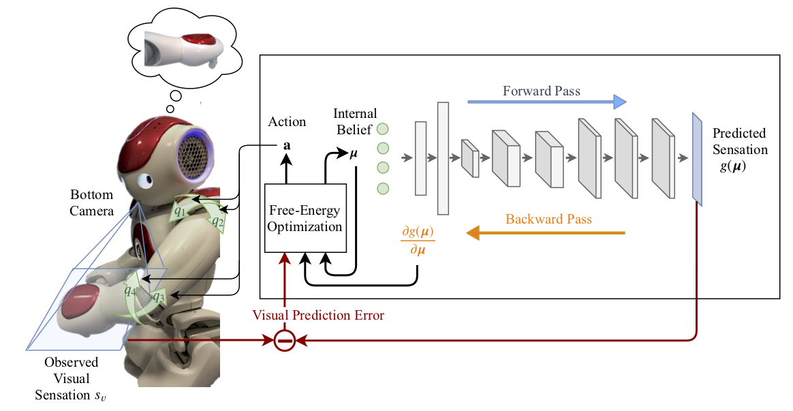
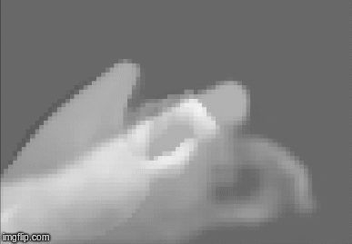
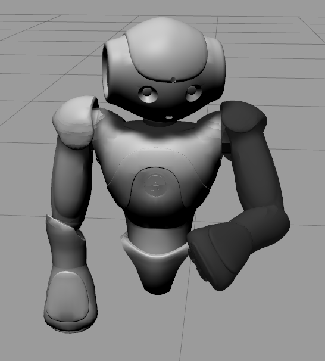
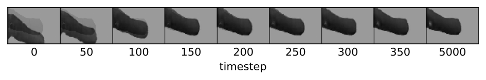

# PixelAI
End-to-End Pixel-Based Deep Active Inference for Body Perception and Action. 

*Published in IEEE International conference on Developmental Learning and Epigenetic Robotics 2020. Paper: https://arxiv.org/abs/2001.05847*

This repository includes code for performing active inference with a simulated NAO robot in Gazebo and offline perceptual inference tests.





## Active Inference with NAO 

Perform active inference with a simulated Nao robot.

### Requirements

*  Ubuntu 16.04
*  ROS Kinetic
*  Pytorch for Python version 2.7

### Installation Steps for the Simulator
The simulator in Gazebo is based on the [nao_gazebo_plugin package](https://github.com/ros-naoqi/nao_virtual/tree/master/nao_gazebo_plugin) and includes modifications from [this repo](https://github.com/matejhof/nao-mirror-self-recog).

1. The default Gazebo version in Ros kinetic is Gazebo 7. First uninstall Gazebo 7 using the following commands:
```shell
$ sudo apt-get remove ros-kinetic-gazebo*
$ sudo apt-get remove libgazebo*
$ sudo apt-get remove gazebo*
```
Then install Gazebo 9 and test:
```shell
$ curl -sSL http://get.gazebosim.org | sh
$ gazebo
```

2. Install catkin tools - [this site](https://catkin-tools.readthedocs.io/en/latest/installing.html)
3. go to catkin_ws
4. Build workspace - catkin build
```shell
$ catkin build
```
5. Source:
```shell
$ source /opt/ros/kinetic/setup.sh
$ source ~/nao_simulation/catkin_ws/devel/setup.bash
```
7. Ready to run active inference tests with the simulator!


### Running Tests for Active Inference

> Start the simulator:

```shell
$ roslaunch nao_gazebo_plugin nao_gazebo.launch
```
> The Gazebo GUI will pop up and the simulator will be paused! Start the simulator.

> Now in a new terminal change directory to the scripts folder of the my_executables package and run the ROS node for active inference tests:

```shell
$ cd ~/nao_simulation/catkin_ws/src/my_executables/scripts
$ rosrun my_executables central_benchmark_active_inference.py
```
Simulated Nao in Gazebo:



##### Changes to Nao in the Simulator:
1. Removed fingers due to simulation issues.
2. Fixed torso in space and removed legs, as they were redundant for the PixelAI application.
3. Color of arm changed.


## Offline Perceptual Inference with NAO 

Inside the directory Benchmark_Perceptual_Offline, perceptual inference benchmark tests can be performed using pre-stored core images for the simulated and real Nao robot.

This directory is not part of the catkin workspace and is independent from ROS, so it can be run using Python 3.x versions as well.

### Running perceptual inference tests:

Run the benchmark tests for the desired level (1-3):
```shell
$ python run_benchmark.py --env 0 --level 2 --mode 1 --log 0 
```
Arguments:
- **env**: 0 for simulated and 1 for real NAO (default 0).
- **level**: 1-3 to choose the benchmark level (default 2).
- **vis**: 1 for visualization at run-time (default 0).
- **log**: 1 to save error logs at each iteration (default 0).
- **mode**: 0 to generate new random start angles for the benchmark cores. Otherwise the values stored in Benchmark_mu* will be used for tests in Level * (default 1).


Run a single test for the desired level-core-test combination and visualize predicted visual sensation trajectory:



```shell
$ python int_traj_recorder.py --env 0 --core 0 --test 0  --save 0 
```
Arguments:
- **env**: 0 for simulated and 1 for real NAO (default 0).
- **level**: 1-3 to choose the benchmark level (default 2).
-  **core**: 0-19 for real robot or 0-49 for simulated robot (default 0).
- **test**: 0-9 to choose the perturbed internal belief or use -1 to generate a new random start value (default 0).
- **save**: 1 to save the resulting trajectory image (default 0).


